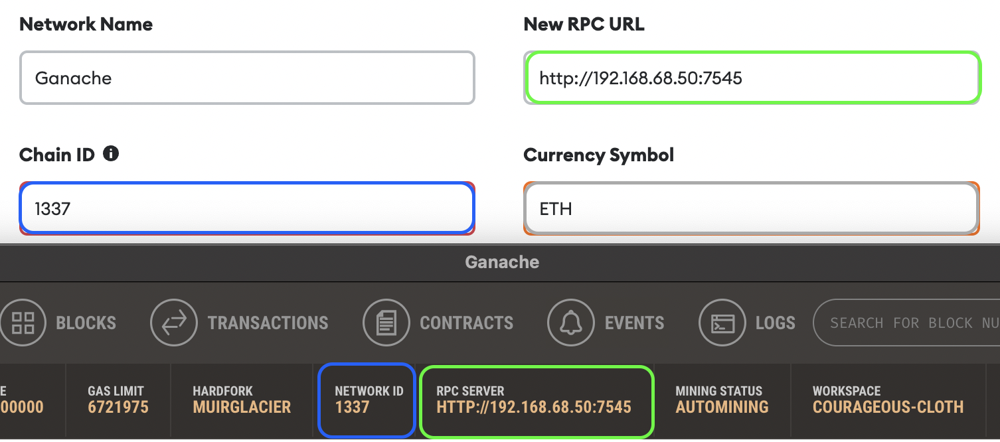
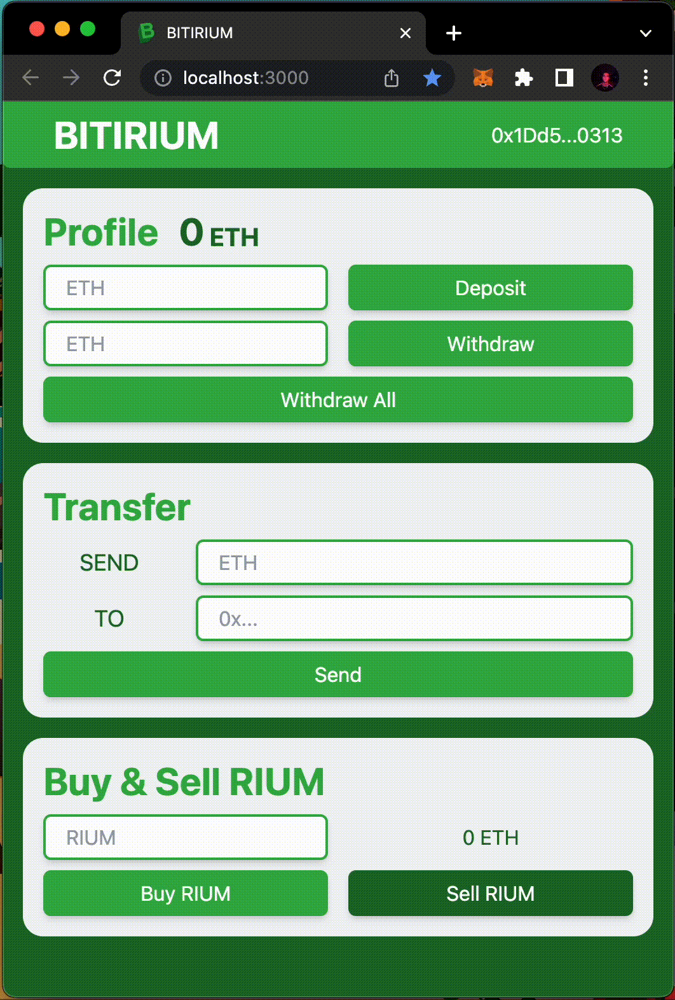
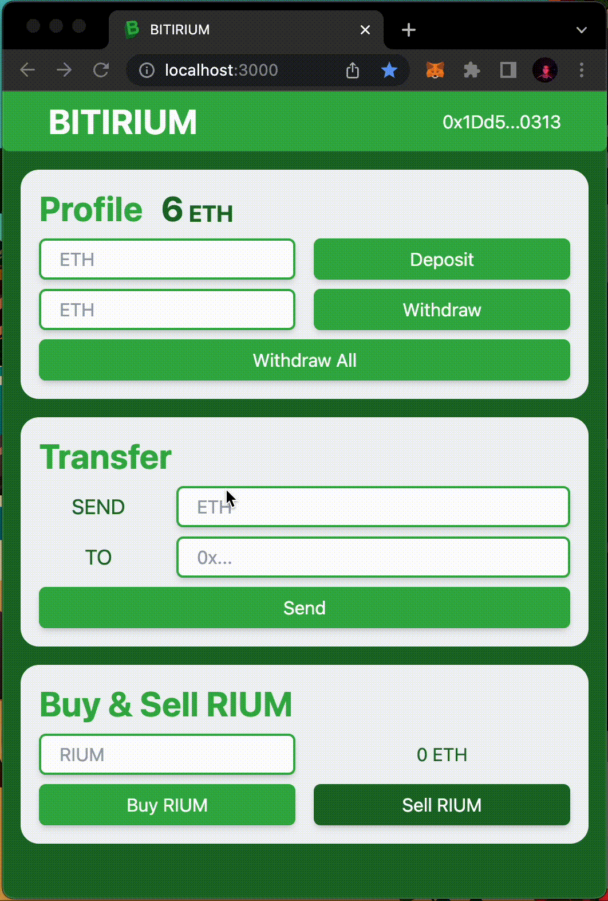
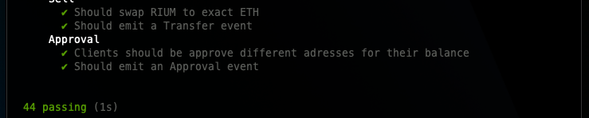

# BITIRIUM

Bitirium is a dApp integrated with Ethereum blockchain.  
In Bitirium, users can deposit, withdraw and transfer Ethereum through the application.  
Bitirium has its own ERC20 token, RIUM. Users can buy and sell $RIUM inside the app.

## Installation

#### Clone the project and install dependencies

```bash
git clone https://github.com/sinanyamaan/bitirium.git
cd bitirium
npm install
```

#### Install [Truffle](https://trufflesuite.com/truffle/) by running

```bash
npm install truffle -g
```

#### Download Ganache from

https://trufflesuite.com/ganache/

### Create Ethereum Workspace in Ganache

1. Open Ganache and click `New Workspace`.
2. In workspace tab, click `Add Project` button and select the `truffle-config.js` file.
3. Go to server tab and select the hostname as your local IP address (selection three) and set the network ID as 1337.
4. Click on the `Save Workspace` button to get the workspace running.
5. Set the host as your local IP address in `truffle-config.js`

```js
// truffle-config.js
...
development: {
      host: "192.168.0.0", // Your local IP address.
      port: 7545,
      network_id: "*",
    },
...
```

### Compile and Deploy Contracts

> For using an address as admin on the app, paste the address to the admin variable on 36th line in `Bitirium.sol`.
>
> ```js
> //Bitirium.sol
> ...
> constructor() {
>        address admin = 0x40EC82dfd76f17Ca42c8744AB9aA70787fA97234; // Your address.
>        users[admin].isAdmin = users[admin].isUser = true;
>    }
> ...
> ```

1. First deploy the Bitirium.sol by running

```bash
truffle migrate --f 1 --to 1
```

2. Copy the contract address and paste it in `src/Credentials.js`, and paste as first parameter of approve function on 56th line of `contracts/RIUM.sol`
3. Then deploy the RIUM.sol by running

```bash
truffle migrate --f 2 --to 2
```

4. Copy the contract address and paste it in `src/Credentials.js`
5. Set localhost variable in `src/Credentials.js` to your local IP address.

### Connect MetaMask to Local Blockchain

1. Open your browser and MetaMask Wallet.
2. Go to Settings > Networks > Add Network.
3. Enter:
   > Network Name: Ganache  
   > New RPC URL: http://192.168.0.0:7545 // Your local IP address.  
   > Chain ID: 1337  
   > Currency Symbol: ETH
4. Click `Save`.

   |  |
   |:------------------------------------------------------------:|
   |       _RPC URL and Chain ID must be same as Ganache._        |

### Import Ganache Accounts to MetaMask

1. Go to Ganache > Accounts.
2. Click the key icon on the right and copy the private key of the account that you want to import.
3. Go to MetaMask > Import Account, paste the private key and click `Import`.

> If you want to use your own accounts, you can send ETH by running
>
> ```bash
> truffle console
> ```
>
> ```bash
> web3.eth.sendTransaction({from: "0x00...00", to: "0x00...00", value: web3.utils.toWei("10")})
> ```
>
> with addresses you want to send, receive and amount of the Ether that will be sent as parameters.

## Running and Using the App

Start the application with:

```
npm start
```

MetaMask will ask you to connect your account.  
Select the account you want to use and click `Connect`.

After that you can use the application in the way you like!

|  |
|:-----------------------------------------------------------------:|
|              _You can deposit ETH in your account._               |

|  |
|:------------------------------------------------------------------:|
|               _You can withdraw ETH to your wallet._               |

|  |
|:------------------------------------------------------------------:|
|               _You can send Ether to your friends._                |

|  |
|:--------------------------------------------------------------:|
|                 _You can buy and sell $RIUM._                  |

|  |
|:---------------------------------------------------------------:|
|             _If you are an admin, you can do more!_             |

> **Warning**\
> For testing the contracts, checkout to test branch with
> ```bash
> git checkout test
> ```
> then run
> ```bash
> npx hardhat test
> ```
>
> |  |
> |:----------------------------------------------------------------:|
> |                          _Test result._                          |